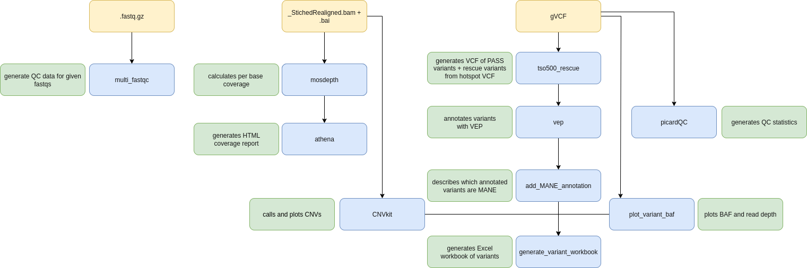

# eggd_TSO500_reports_workflow (DNAnexus Platform Workflow)

DNAnexus workflow to generate coverage reports and Excel workbooks for TSO500 solid cancer service.

---

## What version of apps are used in this workflow?

|  App 	| Version  	|
|---	|---	|
|multi_fastqc       |1.1.0|
|mosdepth           |[1.0.1](https://github.com/eastgenomics/eggd_mosdepth/releases/tag/v.1.0.1)|
|athena             |[1.5.0](https://github.com/eastgenomics/eggd_athena/releases/tag/v1.5.0)|
|eggd_vcf_rescue |[1.1.0](https://github.com/eastgenomics/eggd_vcf_rescue/releases/tag/v1.1.0)|
|eggd_vep           |[1.1.0](https://github.com/eastgenomics/eggd_vep/releases/tag/V1.1.0)|
|eggd_generate_variant_workbook |[2.5.0](https://github.com/eastgenomics/eggd_generate_variant_workbook/releases/tag/v2.5.0)|

## What version of files are used in this workflow?

|  App 	|  Input file 	| Version  	|
|---	|---	|---	|
|mosdepth           | [TST500C_manifest.bed](https://platform.dnanexus.com/projects/Fkb6Gkj433GVVvj73J7x8KbV/data/?scope=project&id.values=file-FkkZQ1Q433GYXZ892pzkgvbP)	| not versioned |
|athena             | [tso500_exons_nirvana_210813_511_genes_v1_0.bed](https://platform.dnanexus.com/projects/Fkb6Gkj433GVVvj73J7x8KbV/data/?id.values=file-G4F6jX04ZFVV3JZJG62ZQ5yJ) | v1.0 |
|athena             | [exons_nirvana2010_no_PAR_Y.tsv](https://platform.dnanexus.com/projects/Fkb6Gkj433GVVvj73J7x8KbV/data/?id.values=file-Fq18Yp0433GjB7172630p9Yv)	| not versioned |
|eggd_vcf_rescue | [220721_TSO500_hotspot_rescue.vcf.gz](https://platform.dnanexus.com/projects/Fkb6Gkj433GVVvj73J7x8KbV/data/?id.values=file-GFGVxxQ4f4z4yz2q38VYz02X)	| 220721 |
|eggd_vep           | [tso500_vep_config_v1.2.2.json](https://platform.dnanexus.com/panx/projects/Fkb6Gkj433GVVvj73J7x8KbV/data/dynamic_files/vep_configs)	| v1.2.2 |
|eggd_vep           | [tso500_vep_transcript_list_b37_v1.1.0.txt](https://platform.dnanexus.com/projects/Fkb6Gkj433GVVvj73J7x8KbV/data/?id.values=file-GP56zxj433GxQVy493QpFP6x)	| v1.1.0 |
