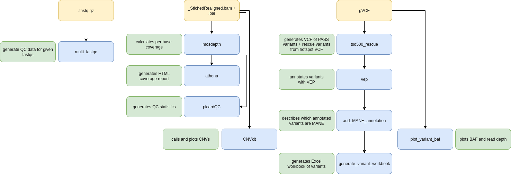

# eggd_TSO500_reports_workflow (DNAnexus Platform Workflow)

DNAnexus workflow to generate coverage reports and Excel workbooks for TSO500 solid cancer service

---

## Current Version: 1.0.0




## What apps are used in this workflow?

|  App 	| Version  	|
|---	|---	|
|mosdepth           |1.0.1|
|athena             |1.4.0|
|eggd_tso500_rescue |1.0.0|
|eggd_vep           |1.0.0|
|eggd_generate_variant_workbook |2.1.0|


How to run the workflow:

```
sample_list=$(dx find data --json --name "*_SampleAnalysisResults.json" | jq -r '.[].describe.name')
sample_list=$(sed s'/_SampleAnalysisResults.json//g' <<< $sample_list)

for sample_prefix in $sample_list; \
  echo $sample_prefix ;\

  dx run workflow-GF2k50Q4b0bf3bY3KyyVJvYy \
    -istage-GF22j384b0bpYgYB5fjkk34X.bam=$(dx find data --name "${sample_prefix}*.bam" --path ${output_path}/analysis_folder/Logs_Intermediates/StitchedRealigned/ --brief) \
    -istage-GF22j384b0bpYgYB5fjkk34X.index=$(dx find data --name "${sample_prefix}*.bai" --path ${output_path}/analysis_folder/Logs_Intermediates/StitchedRealigned/ --brief) \
    -istage-GF22GJQ4b0bjFFxG4pbgFy5V.name=${sample_prefix} \
    -istage-GF25f384b0bVZkJ2P46f79xy.gvcf=$(dx find data --name "${sample_prefix}*.genome.vcf" --path ${output_path}/analysis_folder/Results/ --brief) \
    --destination="${output_path}/$(dx describe --json workflow-GF2k50Q4b0bf3bY3KyyVJvYy | jq -r '.name')" -y; \
done
```

Testing directory:
https://platform.dnanexus.com/projects/GF1V5v84b0bzgy6qJGx4qyjf/data/